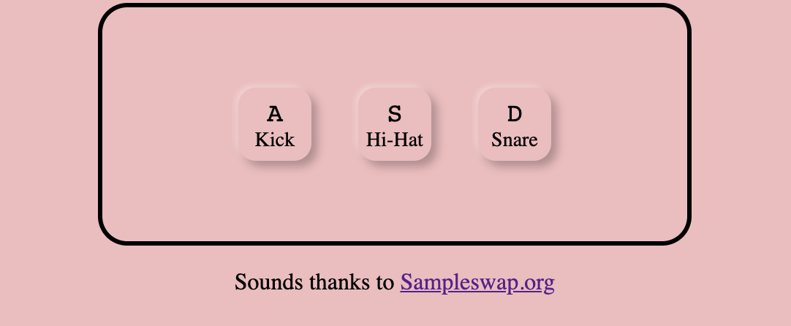

# Day 1 - Virtual Drumkit

Creating a virtual drumkit manipulating the DOM and adding a transition when the key is pressed.

Played with the styles and shadows to add 3 neumorphic buttons:

It doesn't look like a drumset but it sounds like one. :laughing:

> Sound samples thanks to Sampleswap.org
